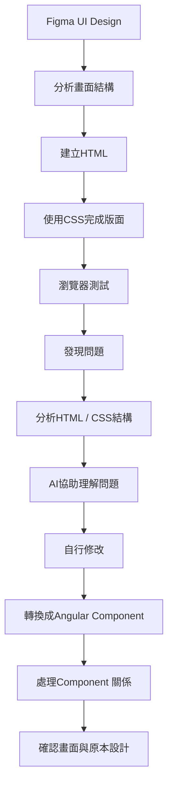

 # Angular Development Log

## 2026/09/13~09/13 - Figma轉HTML/CSS與Angular專案轉換

### 今日目標

開始將智慧醫院管理平台第一階段「醫院預約網站」的Figma UI設計實際轉換為網頁。

原先規劃先使用HTML、CSS 將Figma設計轉換成實際網頁，實作過程中進一步了解到後續專案會使用Angular，因此將已完成的HTML/CSS結構逐步轉換為Angular Component，開始建立正式前端專案的開發架構。

### 完成

- 將Figma設計的首頁Header實作成HTML/CSS。
- 完成首頁Hero區域的 HTML/CSS。
- 完成首頁「快速服務」區域的基本版面。
- 實作 Logo、導覽列、登入按鈕等Header元件。
- 使用Flexbox調整Header、Hero與快速服務區域的版面配置。
- 解決圖片路徑與圖片尺寸問題。
- 將原本的HTML/CSS 案逐步轉換至 Angular。
- 建立Angular Header Component。
- 建立Angular Hero Component。
- 學習Angular Component之間的基本使用方式。
- 解決Angular Component無法顯示的問題。
- 開始使用Git紀錄Angular專案轉換過程。


### 開發過程

#### 1. 將Figma設計轉換成HTML/CSS

完成Figma的Wireframe、UI Design與Prototype後，開始嘗試將設計實際轉換成網頁。
一開始先使用原本比較熟悉的HTML與CSS，從首頁Header開始實作。

希望先理解：

> Figma設計 -> HTML結構 -> CSS版面 -> 瀏覽器實際畫面

透過這個過程，開始了解Figma 中看到的「區塊、文字、圖片、按鈕」實際上需要如何使用HTML元素與CSS組合出來。

#### 2.Header與Logo實作

一開始使用CSS background-image放置Logo：

```
background-image: url(image/logo.png);
```

但圖片沒有顯示。

詢問AI後才了解到，CSS裡的相對路徑是以CSS檔案所在的位置作為基準，而不是以專案根目錄作為基準。

當時的專案結構為：
```
Smart-Hospital
├── index.html
├── css
│   └── style.css
└── image
    └── logo.png
```
因此style.css位於css資料夾中，如果直接寫：
```
url(image/logo.png)
```
瀏覽器會嘗試尋找：
```
css/image/logo.png
```
但實際上的圖片位於：
```
image/logo.png
```
因此需要回到上一層目錄：
```
url(../image/logo.png)
```
透過這個問題第一次了解到**CSS相對路徑是根據CSS檔案的位置計算**。

#### 3. Logo尺寸調整

解決圖片路徑後，又發現Logo顯示時尺寸過大。

一開始嘗試修改height和width，但圖片仍然無法以符合設計的方式完整顯示。

後來了解到可以使用：
```
background-size: contain;
```
讓背景圖片維持原本比例縮放，並完整顯示在指定區域內。
這也讓我了解到圖片尺寸問題不一定只能直接修改width和height，也**可以透過CSS的背景圖片屬性控制圖片如何縮放**。

#### 4. 使用Flexbox 建立Header

在**Header**加入：
```
display: flex;
```
後，原本以為導覽列中的項目也會變成「橫向」排列，但實際上nav裡面的<li>還是「縱向」排列。

後來分析HTML結構後才了解到：
```
<header>
    <h1></h1>
    <nav>
        <ul>
            <li></li>
            <li></li>
            <li></li>
        </ul>
    </nav>
</header>
```
header的「直接子元素」是：

h1
nav

因此：
```
header {
    display: flex;
}
```
只會影響h1與nav。

如果希望 <li> 橫向排列，就需要對它們的父元素 <ul> 使用Flexbox：
```
header ul {
    display: flex;
}
```
這次讓我開始理解:CSS Flexbox是**針對元素的子元素進行排列**，而不是設定在最外層後所有內部元素都會一起受到影響。

#### 5. 開始學習「不要一直用margin推位置」

在調整Hero時，曾經使用：
```
margin-top
```
不斷調整文字與上方元素的距離。

雖然可以讓畫面暫時符合設計，但在詢問AI檢查後了解到，如果大量依靠固定的margin調整位置，可能會讓版面過度依賴特定尺寸，之後修改內容或不同螢幕尺寸時比較難維護。
因此開始學習使用Flexbox的：
```
align-items: center;
```
讓父元素控制子元素的垂直排列方式。

這讓我開始理解：CSS不只是「把東西推到指定位置」，而是應該**先思考整個區塊的排列方式，再使用適合的版面配置工具**。

#### 6. Hero文字與圖片間距調整

在Hero區域中，希望讓文字與圖片的位置更符合Figma設計。
一開始使用：
```
margin-left
```
將文字往右移。
後來了解到，如果這個文字區塊本身需要「內部空間」，比較適合使用：
```
padding-left
```
而不是單純透過margin把元素推動。

但實際調整時又發現，增加padding-left後，整個內容區域也會受到影響，圖片位置也跟著改變。

這個問題讓我了解到，**CSS的定位不能只看單一屬性**，而需要一起考慮：

margin
padding
gap
width
Flexbox 排列方式

因此後續調整版面時，開始先分析「是哪一層的元素需要移動」，再決定要修改哪個CSS屬性。

#### 7.從HTML/CSS轉換成Angular

在實作了一部分HTML/CSS後，重新確認專案原本規劃的技術方向，發現後續需要使用Angular，因此決定不繼續以傳統多頁HTML 方式完成整個網站，而是開始將目前完成的內容逐步轉換成Angular。

這次轉換也讓我第一次接觸到Angular Component。

原本的網站：
```
index.html
└── Header
└── Hero
└── Quick Service
```
開始轉換成：
```
Angular
└── App
    ├── Header Component
    ├── Hero Component
    └── Quick Service Component
```
這讓我了解到Angular的Component概念，**可以將不同功能或畫面區域拆開管理**，而不是所有HTML、CSS都集中在同一個檔案。

#### 8.Angular Header Component無法顯示

將原本的Header HTML/CSS移動到Angular Component後，第一次執行時發現畫面沒有按照預期顯示。

檢查錯誤訊息後，發現Angular提示：
```
NG8001: 'app-header' is not a known element
```
詢問 AI 後了解到，Angular Component並不是建立完成後就可以直接在其他Component使用。
在目前使用的Angular standalone component架構中，需要在app.ts的imports中加入 Header Component。

例如：
```
import { Header } from './header/header';

@Component({
    ...
    imports: [Header]
})
```
而app.html才能使用：
```
<app-header></app-header>
```
透過這個錯誤，我第一次了解到：

> Header Component -> 需要被App Component引入 -> imports: [Header] -> App才能使用 <app-header>

也開始理解Angular Component不是單純把HTML拆成不同檔案，而是**有自己的Component關係與使用方式**。

#### 9. Angular圖片路徑問題

完成Angular Component轉換後，又遇到Logo無法顯示的問題。
原本 HTML/CSS 專案使用：
```
background-image: url('../image/logo.png');
```
但轉換到Angular後，這個路徑不再適用。

後來了解到Angular專案的靜態圖片可以放在：
```
public
└── image
    └── logo.png
```
CSS則改成：
```
background-image: url('/image/logo.png');
```
這次讓我了解到，傳統HTML專案與Angular專案對靜態資源的處理方式不同。

因此不能只是把原本的HTML/CSS原封不動搬到Angular，而是**需要理解Angular專案本身的檔案結構與資源管理方式**。

#### 10.Angular轉換後的版面與原本Figma不一致

完成Header Angular化後，發現原本HTML/CSS的畫面與轉換後的Angular畫面，在Logo大小、文字位置以及整體間距上有些差異。

一開始嘗試自行調整CSS，但當調整到一定程度後，發現很難快速定位是哪一個CSS屬性造成差異。

因此這次選擇使用Codex協助修改目前的CSS。

不過我沒有直接把整個專案交給Codex重新製作，而是先讓Codex根據目前的程式碼進行修改，再將修改內容交給GPT解釋。

這次使用AI的方式讓我有很大的體會：

Codex很適合協助快速修改程式碼、尋找Bug或處理大型專案中的局部問題；而GPT比較適合在修改後協助我理解「為什麼要這樣改」。

因此目前希望讓兩種AI工具扮演不同角色：

> 自己思考與實作 -> 遇到問題 -> GPT：分析問題、理解觀念-> 需要大量修改時 -> Codex：協助修改程式碼 -> GPT：解釋 Codex 修改的內容 ->自己確認與理解

**我認為這樣的方式，比直接讓AI完成整個網站，更能保留自己對程式碼的理解**。

#### 11.快速服務卡片的實作

在實作首頁「快速服務」區域時，一開始不知道Figma中的卡片應該如何轉換成HTML。
後來了解到可以將每一張卡片視為一個容器：
```
<div class="service-card">
    ...
</div>
```
例如：
```
快速服務
│
├── service-card
│   ├── icon
│   └── 立即預約
│
├── service-card
│   ├── icon
│   └── 醫師查詢
│
├── service-card
│   ├── icon
│   └── 查詢預約
│
└── service-card
    ├── icon
    └── 就醫資訊
```
再透過：

border
width
height
border-radius
display: flex

建立卡片的外觀與排列。

這次實作讓我發現，很多看起來比較複雜的UI，其實都是由前面學過的HTML與CSS基礎元素組合而成。

真正困難的地方不是每一個CSS屬性，而是要理解：

**「我要如何把Figma中看到的畫面拆解成HTML結構？」

### 解決方式

這次開發過程中，沒有直接重新製作整個頁面，而是以「發現問題 -> 分析原因 -> 嘗試解決 -> 使用AI輔助 -> 理解修改內容的方式逐步處理。

從最初的HTML/CSS開始，到後來轉換成Angular，也讓我發現：

- Figma的畫面不等於HTML結構。
- HTML結構會影響CSS的排列方式。
- CSS的問題需要先分析父子元素關係。
- Angular不只是把HTML放進Component，而是需要理解Component之間的關係。
- 傳統HTML專案與Angular的檔案結構及資源處理方式不同。
- AI可以協助解決問題，但自己理解修改原因仍然很重要。

### 今日學習

- 學習如何將Figma UI拆解成HTML結構。
- 學習CSS相對路徑的判斷方式。
- 學習background-size: contain的使用方式。
- 進一步理解Flexbox父子元素的排列關係。
- 學習margin、padding、gap的差異與使用時機。
- 學習如何使用HTML/CSS建立UI卡片。
- 開始理解 Angular Component 的概念。
- 學習Angular standalone component的imports。
- 了解Angular public資料夾與圖片路徑的關係。
- 開始學習如何將原本的HTML/CSS專案逐步轉換成Angular。
- 嘗試讓GPT與Codex在專案中扮演不同的輔助角色。

### 今日開發流程


  
### AI協助

- 在遇到CSS圖片路徑、Flexbox、間距與版面問題時，使用AI協助分析原因。
- 在遇到Angular Component無法顯示時，透過AI理解imports與Component之間的關係。
- 在HTML/CSS轉換Angular後遇到圖片路徑問題時，透過AI了解Angular public資料夾的使用方式。
- 在CSS調整較複雜時，使用Codex協助進行局部修改。
- 將Codex修改的程式碼再交由GPT解釋，理解修改的原因與程式碼作用。
- AI 要用於問題分析、觀念學習與加速開發，而不是直接產生整個專案。

### 今日學習成果


