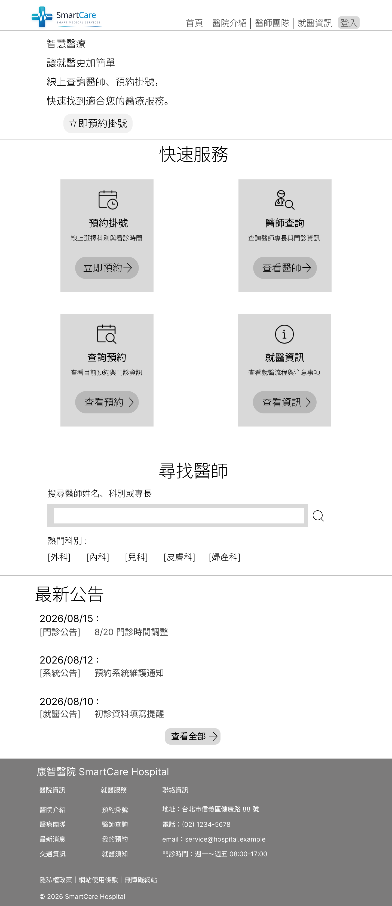
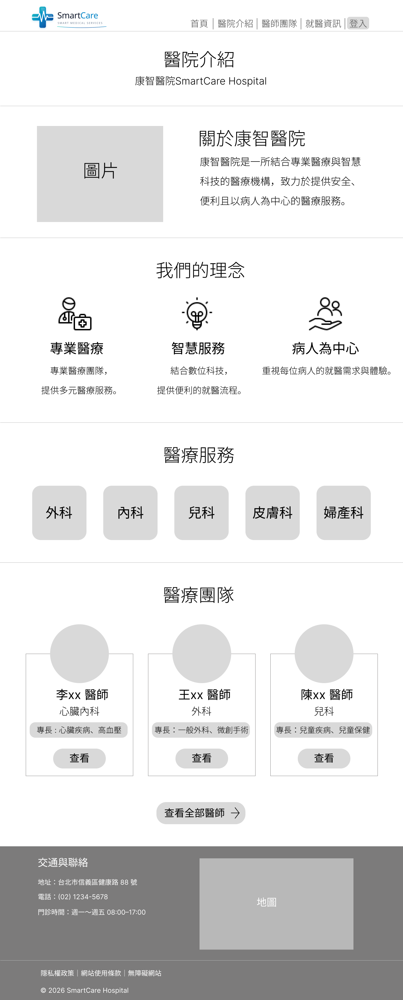

# Development Log

## 2026/08/15 - 需求分析

### 完成
- 完成智慧醫院管理平台第一階段需求分析
- 定義病人與醫師兩種使用者角色
- 規劃病人預約流程
- 確定第一階段開發範圍

### 遇到的問題
一開始不知道醫院網站應該包含哪些功能，
也不確定是否應該同時開發病人端與醫師端。

### 解決方式
參考實際醫院網站的掛號流程，
將系統拆分成病人端與醫師端，
第一階段以病人預約功能為主要開發內容。

### 學到什麼
了解需求分析不只是列功能，
還需要確認使用者、使用情境與開發範圍。

### 下一步

- 完成首頁和醫院介紹頁Wireframe
- 學習規劃網站資訊架構
- 學習區分功能區塊

### AI協助
使用AI協助檢查有沒有缺的功能/改進的功能描述，並請AI整理實際醫院網站使用流程作參考。

## 2026/08/16 - Figma Wireframe設計

### 目標

完成智慧醫院管理平台第一階段「醫院預約網站」的首頁與醫院介紹頁Wireframe。

### 完成

- 完成首頁 Wireframe 初版
- 調整首頁資訊架構
- 新增快速服務區塊
- 新增尋找醫師功能區塊
- 完成最新公告區塊
- 完成 Footer 資訊規劃
- 完成醫院介紹頁Wireframe
- 規劃醫院簡介、醫療理念、醫療服務、醫療團隊、交通與聯絡等區塊

### 設計思考

原本首頁的資訊比較偏向一般形象網站，因此重新調整首頁的資訊層級。

將「預約掛號」、「醫師查詢」、「查詢預約」、「就醫資訊」放在快速服務區域，讓使用者可以快速找到主要功能。

另外新增「尋找醫師」區塊，讓使用者可以從首頁搜尋醫師姓名、科別或專長。

醫院介紹頁則將醫院資訊與首頁功能區分開，主要介紹醫院本身、醫療理念、醫療服務、醫療團隊以及交通與聯絡資訊。

### 遇到的問題

一開始不確定醫院網站首頁應該放哪些內容，也不確定哪些功能應該放在導覽列。

不知道怎樣的排版比較接近正式的醫院系統，或是怎樣的排版方式會讓使用者一目了然。

### 解決方式

重新思考使用者進入醫院網站後最常進行的操作，將主要功能集中在首頁的快速服務區域。

同時將「醫院介紹」頁面定位為介紹醫院本身，而不是放置預約等主要操作功能。

### 今日學習

- 了解Wireframe的用途
- 了解網站資訊架構的重要性
- 開始區分「網站介紹內容」與「系統功能」
- 了解首頁需要優先呈現使用者最常使用的功能
- 練習使用 Figma 規劃網站頁面結構

### 下一步

- 完成醫師查詢頁Wireframe
- 規劃醫師搜尋與科別篩選流程
- 規劃醫師詳細資料頁

### AI協助
透過AI發想排版思路與資訊架構，協助校對並修正版面佈局。

### 今日學習成果

> **首頁Wireframe**

![首頁 Wireframe](./screenshots/# Development Log

## 2026/08/15 - 需求分析

### 完成
- 完成智慧醫院管理平台第一階段需求分析
- 定義病人與醫師兩種使用者角色
- 規劃病人預約流程
- 確定第一階段開發範圍

### 遇到的問題
一開始不知道醫院網站應該包含哪些功能，
也不確定是否應該同時開發病人端與醫師端。

### 解決方式
參考實際醫院網站的掛號流程，
將系統拆分成病人端與醫師端，
第一階段以病人預約功能為主要開發內容。

### 學到什麼
了解需求分析不只是列功能，
還需要確認使用者、使用情境與開發範圍。

### 下一步

- 完成首頁和醫院介紹頁Wireframe
- 學習規劃網站資訊架構
- 學習區分功能區塊

### AI協助
使用AI協助檢查有沒有缺的功能/改進的功能描述，並請AI整理實際醫院網站使用流程作參考。

## 2026/08/16 - Figma Wireframe設計

### 目標

完成智慧醫院管理平台第一階段「醫院預約網站」的首頁與醫院介紹頁Wireframe。

### 完成

- 完成首頁 Wireframe 初版
- 調整首頁資訊架構
- 新增快速服務區塊
- 新增尋找醫師功能區塊
- 完成最新公告區塊
- 完成 Footer 資訊規劃
- 完成醫院介紹頁Wireframe
- 規劃醫院簡介、醫療理念、醫療服務、醫療團隊、交通與聯絡等區塊

### 設計思考

原本首頁的資訊比較偏向一般形象網站，因此重新調整首頁的資訊層級。

將「預約掛號」、「醫師查詢」、「查詢預約」、「就醫資訊」放在快速服務區域，讓使用者可以快速找到主要功能。

另外新增「尋找醫師」區塊，讓使用者可以從首頁搜尋醫師姓名、科別或專長。

醫院介紹頁則將醫院資訊與首頁功能區分開，主要介紹醫院本身、醫療理念、醫療服務、醫療團隊以及交通與聯絡資訊。

### 遇到的問題

一開始不確定醫院網站首頁應該放哪些內容，也不確定哪些功能應該放在導覽列。

不知道怎樣的排版比較接近正式的醫院系統，或是怎樣的排版方式會讓使用者一目了然。

### 解決方式

重新思考使用者進入醫院網站後最常進行的操作，將主要功能集中在首頁的快速服務區域。

同時將「醫院介紹」頁面定位為介紹醫院本身，而不是放置預約等主要操作功能。

### 今日學習

- 了解Wireframe的用途
- 了解網站資訊架構的重要性
- 開始區分「網站介紹內容」與「系統功能」
- 了解首頁需要優先呈現使用者最常使用的功能
- 練習使用 Figma 規劃網站頁面結構

### 下一步

- 完成醫師查詢頁Wireframe
- 規劃醫師搜尋與科別篩選流程
- 規劃醫師詳細資料頁

### AI協助
透過AI發想排版思路與資訊架構，協助校對並修正版面佈局。

### 今日學習成果

> **首頁Wireframe**

> **醫院介紹Wireframe**

