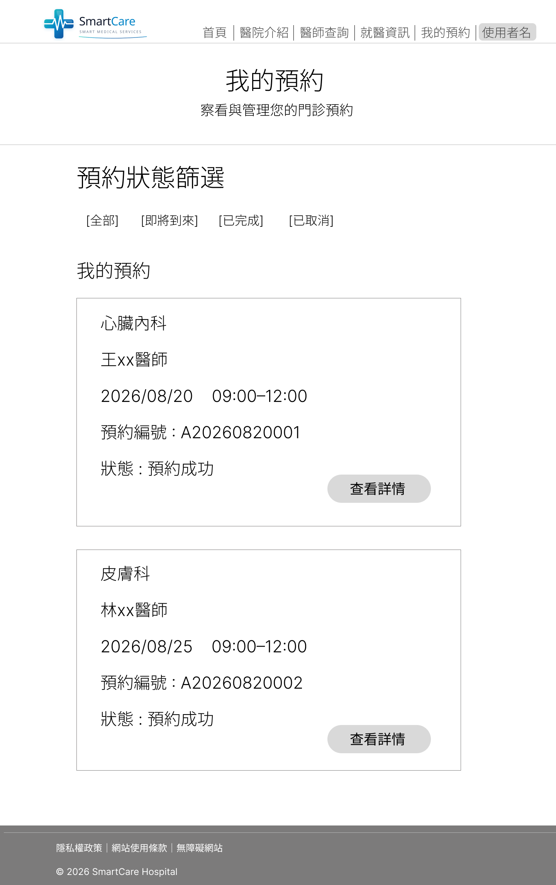
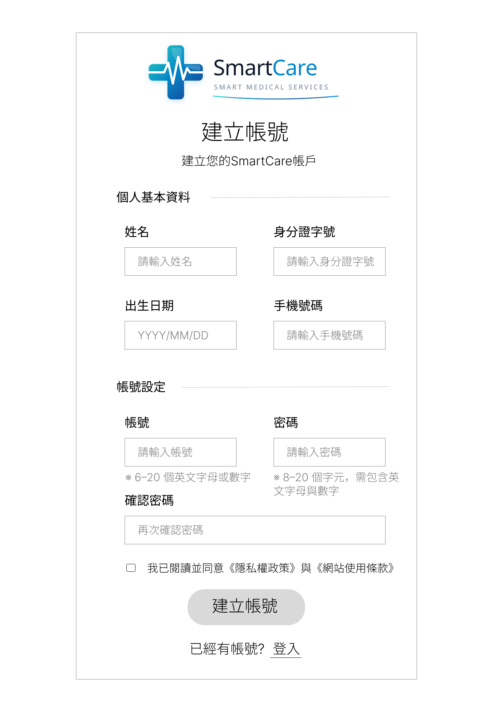
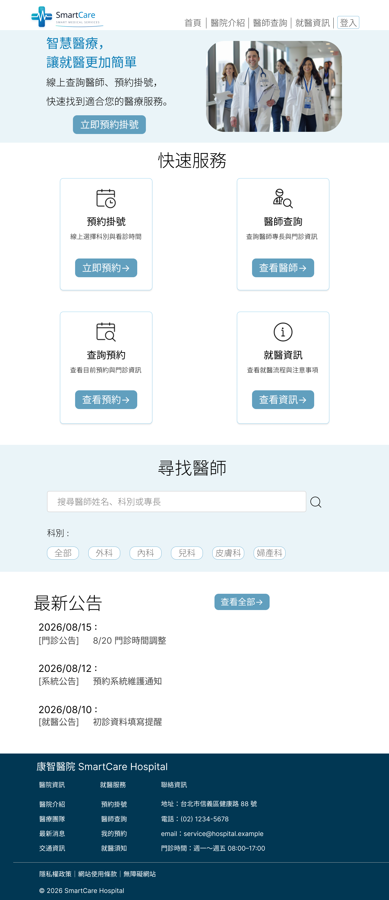
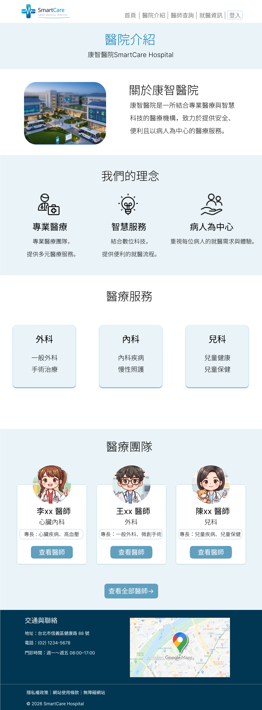
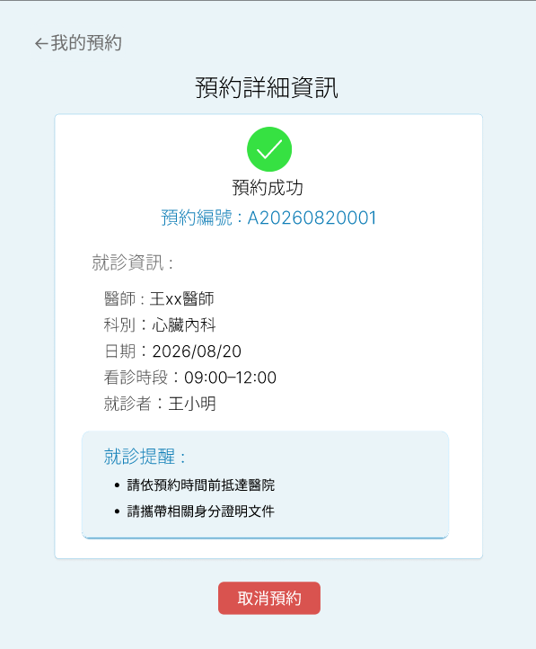
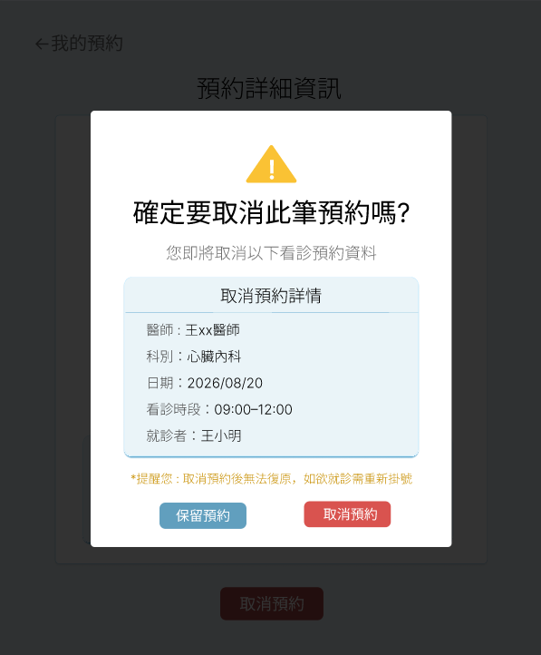
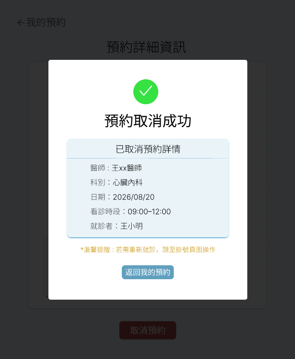
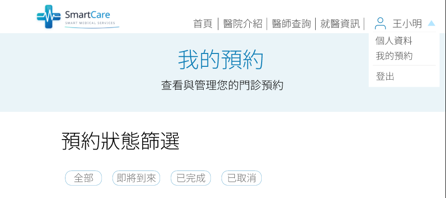
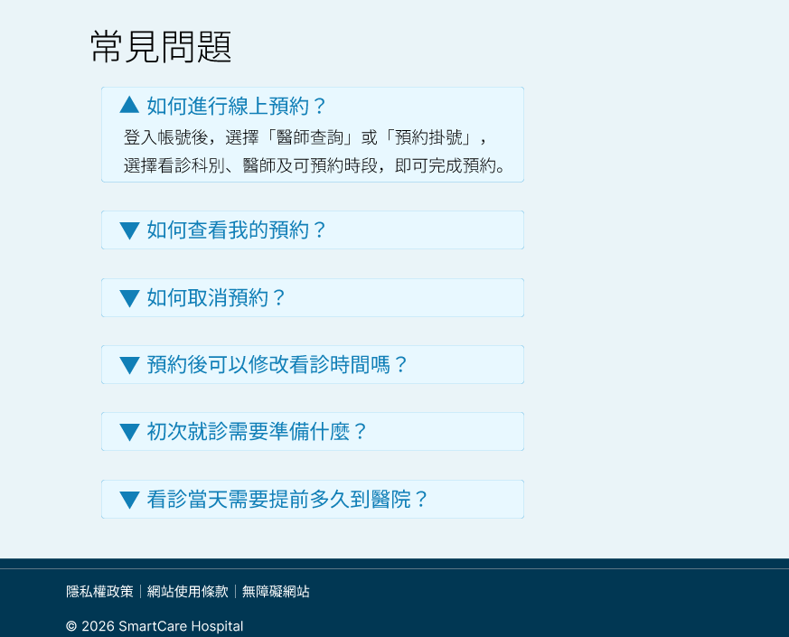

 # Development Log

## 2026/08/15 - 需求分析

### 完成
- 完成智慧醫院管理平台第一階段需求分析
- 定義病人與醫師兩種使用者角色
- 規劃病人預約流程
- 確定第一階段開發範圍

### 遇到的問題
一開始不知道醫院網站應該包含哪些功能，
也不確定是否應該同時開發病人端與醫師端。

### 解決方式
參考實際醫院網站的掛號流程，
將系統拆分成病人端與醫師端，
第一階段以病人預約功能為主要開發內容。

### 學到什麼
了解需求分析不只是列功能，
還需要確認使用者、使用情境與開發範圍。

### 下一步

- 完成首頁和醫院介紹頁Wireframe
- 學習規劃網站資訊架構
- 學習區分功能區塊

### AI協助
使用AI協助檢查有沒有缺的功能/改進的功能描述，並請AI整理實際醫院網站使用流程作參考。


## 2026/08/16 - Figma Wireframe設計

### 目標

完成智慧醫院管理平台第一階段「醫院預約網站」的首頁與醫院介紹頁Wireframe。

### 完成

- 完成首頁 Wireframe 初版
- 調整首頁資訊架構
- 新增快速服務區塊
- 新增尋找醫師功能區塊
- 完成最新公告區塊
- 完成 Footer 資訊規劃
- 完成醫院介紹頁Wireframe
- 規劃醫院簡介、醫療理念、醫療服務、醫療團隊、交通與聯絡等區塊

### 設計思考

原本首頁的資訊比較偏向一般形象網站，因此重新調整首頁的資訊層級。

將「預約掛號」、「醫師查詢」、「查詢預約」、「就醫資訊」放在快速服務區域，讓使用者可以快速找到主要功能。

另外新增「尋找醫師」區塊，讓使用者可以從首頁搜尋醫師姓名、科別或專長。

醫院介紹頁則將醫院資訊與首頁功能區分開，主要介紹醫院本身、醫療理念、醫療服務、醫療團隊以及交通與聯絡資訊。

### 遇到的問題

一開始不確定醫院網站首頁應該放哪些內容，也不確定哪些功能應該放在導覽列。

不知道怎樣的排版比較接近正式的醫院系統，或是怎樣的排版方式會讓使用者一目了然。

### 解決方式

重新思考使用者進入醫院網站後最常進行的操作，將主要功能集中在首頁的快速服務區域。

同時將「醫院介紹」頁面定位為介紹醫院本身，而不是放置預約等主要操作功能。

### 今日學習

- 了解Wireframe的用途
- 了解網站資訊架構的重要性
- 開始區分「網站介紹內容」與「系統功能」
- 了解首頁需要優先呈現使用者最常使用的功能
- 練習使用 Figma 規劃網站頁面結構

### 下一步

- 完成醫師查詢頁Wireframe
- 規劃醫師搜尋與科別篩選流程
- 規劃醫師詳細資料頁

### AI協助
透過AI發想排版思路與資訊架構，協助校對並修正版面佈局。

### 今日學習成果

> **首頁Wireframe**


## 2026/08/18 - Figma Wireframe設計

### 目標

完成智慧醫院管理平台第一階段「醫院預約網站」的醫師查詢頁、醫師詳細資料頁、預約掛號頁、預約成功頁Wireframe。

### 完成

- 完成醫師查詢頁Wireframe
- 完成醫師詳細資料Wireframe
- 完成預約掛號頁Wireframe
- 完成預約成功頁Wireframe
- 規劃醫師搜尋功能
- 規劃病人資料自動帶入
- 規劃科別篩選功能\

### 設計思考

本次主要以"使用者完成預約"為核心，完成醫師查詢頁、醫師詳細資料頁、預約掛號頁、預約成功頁四個頁面。

醫師查詢頁 : 提供搜尋跟科別篩選，讓使用者可以快速找到適合的醫師。

醫師詳細資料頁 : 提供醫師的科別、專長、學經歷及門診時間，讓使用者能在預約前可以先了解醫師資訊。

預約掛號頁 : 讓使用者選擇看診日期與時間，並確認病人資料和填寫病人就診原因。
(這頁預設要會員登入後才能預約，所以導覽列上的登入要改成使用者名字。)
(使用者登入時會填寫基本資料，因此預約頁的病人資料會自動帶入>)

預約成功頁 : 顯示預約編號、醫師、日期、就診時間和就診者資料，讓使用者確定是否成功預約
(如果發現預約資訊有誤，可以點按鈕到查看我的預約頁做修改。)

### 遇到的問題

1.不確定醫師查詢頁應該顯示多少位醫師，如果全部顯示會讓頁面過長，使用者也不容易找到想預約的醫師。

2.AI原本提供的預約掛號頁排版，裡面需要填病人基本資料，但我已經想好要在註冊頁的時候完成病人基本資料填寫，再填一次會很麻煩。

### 解決方式

1.詢問AI建議，在醫師查詢頁加入搜尋、科別搜尋與分頁功能，讓使用者方便查找醫師。

2.將預約掛號頁的病人資料欄，設定成自動帶入登入會員資料，並讓使用者可以修改資料。

### 今日學習

- 了解搜尋與篩選功能在醫師列表中的用途
- 了解預約流程需要哪些基本資料
- 學習如何設計連續的使用者操作規劃及功能
- 思考登入資料與預約資料之間的關聯
- 開始思考這些頁面要怎麼設計Prototype，操作起來會比較流暢

### 下一步

- 完成我的預約頁、就醫資訊業、註冊登入頁Wireframe
- 進行每頁的UI設計

### AI協助
透過AI發想排版思路與資訊架構，協助校對並修正版面佈局，提供解決方法和功能設計建議。

### 今日學習成果

> **醫師詳細資料頁Wireframe**


> **預約掛號頁Wireframe**


## 2026/08/20 - Figma Wireframe設計

### 目標

完成智慧醫院管理平台第一階段「醫院預約網站」的我的預約頁、預約詳細頁、取消預約頁、預約取消成功頁、就醫資訊頁、登入/註冊頁Wireframe。

### 完成

- 完成我的預約頁Wireframe
- 完成預約詳細頁Wireframe
- 完成取消預約頁Wireframe
- 完成預約取消成功頁Wireframe
- 完成就醫資訊頁Wireframe
- 完成登入/註冊頁Wireframe
- 規劃預約詳細頁Prototype會接到那些畫面
- 規劃註冊頁所需資料

### 設計思考

本次主要以"使用者查看/取消預約"、"登入/註冊"為核心，完成我的預約頁、預約詳細頁、取消預約頁、預約取消成功頁、就醫資訊頁、登入/註冊頁，七個頁面。

我的預約頁 : 提供預約狀態篩選，讓使用者可以快速查看自己的預約。

預約詳細頁 : 查看預約詳情，並提供取消預約按鈕。

取消預約頁 : 再次讓使用者確認是否取消預約。
(這頁到時候設定Prototype會從下面彈出頁面。)

預約取消成功頁 : 顯示成功取消，並提供返回我的預約按鈕。

就醫資訊頁 : 提供就醫流程、就診須知等相關資訊。

登入/註冊頁 : 讓使用者填寫基本訊息並註冊帳號，方便後面登入。

### 遇到的問題

1.不知道「 預約詳細頁 」的點擊查看詳情按鈕和取消預約按鈕，是直接切換新畫面還是以由下往上彈出的形式呈現。

2.註冊時所填寫的資料需不需要放體重、病史等相關資料。

### 解決方式

1.詢問AI建議，「 像預約詳細頁 」的點擊查看詳情按鈕，有大量資訊就是切換到新頁面;取消預約按鈕會顯示小段的提示文字，適合由下往上彈出的形式。

2.AI建議我註冊頁面放基本資料，而關於醫療資料就放在醫師端。

### 今日學習

- 了解取消預約流程
- 了解註冊頁內容
- 學習如何設計查看預約到取消預約的流程
- 開始思考這些頁面要怎麼設計Prototype

### 下一步

- 完成每頁的UI設計

### AI協助
透過AI發想排版思路與資訊架構，協助校對並修正版面佈局，提供解決方法和功能設計建議。

### 今日學習成果

> **我的預約頁Wireframe**



> **註冊頁Wireframe**




## 2026/08/26 - UI 設計

### 今日目標

開始將智慧醫院管理平台第一階段「醫院預約網站」的Wireframe轉換為正式UI設計。

### 完成

- 完成首頁UI設計
- 完成醫院介紹頁UI設計
- 完成醫師查詢頁UI設計
- 建立網站主要色彩與視覺風格
- 統一標題、按鈕、輸入框與卡片等元件的設計，設定元件Prototype
- 調整各頁面的間距、文字大小與版面配置
- 開始建立網站共用的UI Component

### 設計思考

本次開始將先前完成的Wireframe轉換成實際的UI設計。

整體視覺以「醫療、科技、簡潔」為主要方向，因此選擇淺藍色作為主要視覺色彩，搭配白色與深藍色，讓網站具有醫療網站的專業感，同時保持簡潔易讀。

首頁:主要建立按鈕Prototype component，設定Hover懸浮效果和點擊效果、方便後面頁面直接做使用。

醫院介紹頁:建立醫療服務卡片Prototype，讓卡片頁面呈現往左滑動效果。

醫師查詢頁:建立查詢輸入框Prototype component，設定Hover懸浮效果和點擊效果，醫師列表顯示6張卡片作為範例。

### 遇到的問題

1. Wireframe原本比較偏向功能與版面配置，轉換成UI後需要重新調整文字大小、間距與區塊比例。
2. 不確定網站應該使用哪些顏色，才能同時符合醫療網站的風格並保持一致。
3. 按鈕和輸入框Hover效果和點擊效果不知道怎麼呈現。

### 解決方式

1. 以Wireframe作為版面基礎，再逐一調整字體大小、間距、區塊高度與對齊方式。
2. 使用淺藍色作為主要色彩，搭配白色背景與深藍色Footer，建立醫療網站的視覺風格。
3. 詢問AI建議，Hover顏色變淺，點擊效果在更淺。

### 今日學習

- 了解Wireframe與UI Design的差異
- 學習將Wireframe轉換成實際UI
- 學習統一按鈕、輸入框與卡片等UI元件
- 學習設計Hover、點擊效果

### 下一步

- 完成剩餘頁面的UI設計
- 統一各頁面的UI Component
- 完成主要頁面的Prototype

### AI 協助

透過AI協助發想UI配色、版面配置與Component設計方式，並針對不同頁面的資訊層級提供設計建議。

### 今日學習成果

> **首頁 UI Design**



> **醫院介紹頁 UI Design**




## 2026/08/28 - UI 設計

### 今日目標

開始將智慧醫院管理平台第一階段「醫院預約網站」的Wireframe轉換為正式UI設計。

### 完成

- 完成醫師詳細介紹頁UI設計
- 完成預約掛號頁UI設計
- 完成預約成功頁UI設計
- 完成我的預約頁UI設計
- 完成預約詳細頁 UI 設計
- 完成取消預約提示視窗與取消預約成功視窗 UI 設計
- 完成取消預約提示和取消預約成功提示Prototype
- 建立網站共用的 UI Component

### 設計思考

本次完成剩下頁面的Wireframe轉換成實際的UI設計，並針對不同功能規劃適合的資訊呈現方式與互動效果。

1. 醫師詳細介紹頁
 - 使用醫師資訊卡片呈現醫師基本資料。
 - 使用門診時間表格呈現醫師的門診資訊。
 - 讓使用者可以快速了解醫師資料與看診時間。
2. 預約掛號頁
 - 提供預約日期與時間選擇功能。
 - 輸入框加入Hover與選取狀態。
 - 讓使用者能清楚知道目前選擇的項目。
3. 預約成功頁
 - 上方顯示預約成功圖示。
 - 下方顯示就診日期、時間等預約資訊。
 - 加入相關提醒，讓使用者確認預約是否完成。
4. 我的預約頁
 - 使用卡片方式呈現預約資訊。
 - 顯示目前的預約數量。
 - 使用者可以透過「查看」按鈕進入預約詳細頁。
5. 預約詳細頁與取消預約流程
 - 在預約詳細頁提供「取消預約」功能。
 - 點擊取消後，先顯示取消預約確認視窗。
 - 點擊「確認取消」後，切換至取消預約成功提示。
 - 透過Prototype將兩個Overlay串接成完整的操作流程。

### 遇到的問題

**問題 1：預約詳細頁的設計方式**

不確定預約詳細頁是否要延續前面頁面的設計風格，還是使用不同的版面呈現。

**問題 2：取消預約提示的呈現方式**

不確定取消預約提示應該設計成獨立頁面，還是使用彈出視窗呈現。

**問題 3：如何串接取消預約流程**

不清楚如何在取消預約提示視窗中點擊確認按鈕後，再切換到取消預約成功提示。

### 解決方式

**問題 1：預約詳細頁**

參考 AI 提供的設計建議後，將預約詳細頁設計成獨立的資訊頁面。

 - 使用淺藍色作為背景。
 - 中間放置白色資訊卡片。
 - 將預約相關資訊集中在卡片中呈現。

**問題 2：取消預約提示**

使用Figma Prototype的Open overlay(開啟浮層)功能製作彈出視窗。

設定：

> Action → Open overlay → Position → Center

讓取消預約提示視窗從頁面中央顯示，而不需要另外建立一個完整頁面。

**問題 3：取消預約成功提示**

使用Figma Prototype的Swap overlay功能。

操作流程：

 ```mermaid
flowchart TD
    A[預約詳細頁] --> B[點擊「取消預約」]
    B --> C[Open overlay]
    C --> D[取消預約確認視窗]
    D --> E[點擊「確認取消」]
    E --> F[Swap overlay]
    F --> G[取消預約成功提示]
    
```

### 今日學習

 - 學習Prototype的Overlay使用方式。
 - 學習Open overlay的使用方式。
 - 學習Swap overlay的使用方式。
 - 了解如何將多個Overlay串接成完整的操作流程。

### 下一步

- 完成剩餘頁面的UI設計
- 設計全部頁面的Prototype
  
### AI 協助

透過AI協助釐清頁面版面配置、UI設計方向，以及Figma Prototype的操作方式。

在遇到設計與互動流程問題時，先整理自己的需求與問題，再參考AI提供的建議，最後依照專案需求進行調整與實作。

### 今日學習成果

> **預約詳細頁 UI Design**



> **取消預約提示**



> **取消預約成功提示**




## 2026/09/08 - UI設計和Protytype設計

### 今日目標

開始將智慧醫院管理平台第一階段「醫院預約網站」的Wireframe轉換為正式UI設計，並開始進行Protytype設計。

### 完成

- 完成登入/註冊UI設計
- 完成部分頁面的Protytype串接
- 完成FQA問題展開/收合Protytype設計
- 學習如何用Text Property(文字屬性)製作FQA
- 建立網站共用的 UI Component
- 完成部分頁面之間的操作流程串接

### 設計思考

本次完成剩下頁面的Wireframe轉換成實際的UI設計，並開始將頁面之間的操作流程加入Prototype。過程中也針對使用者登入、FAQ 展開／收合，以及公告分頁等互動方式進行調整。

1. 登入頁
 - 使用者輸入帳號和密碼。
 - 提供「記住帳號密碼」和「忘記密碼」功能。
 - 未註冊的使用者可點擊「還沒註冊」連結至註冊頁。
2. 註冊頁
 - 提供使用者輸入基本資料和帳號設置。
 - 部分輸入框下方寫有提示文字，協助使用者完成填寫。
 - 提供「閱讀須知」勾選功能。
 - 已有帳號的使用者可點擊「登入」連結返回登入頁。
3. 一般頁面按鈕串接
 - 將各頁面的按鈕連接至對應頁面。
 - 依照使用者操作流程設定頁面之間的Protytype互動
4. 就醫資訊頁面的FQA
 - 使用Text Property製作一個可以重複使用的FQA模板
 - 設計FQA問題的展開/收回Protytype
 - 點擊問題後展開對應答案，再次操作可收合內容。
5. 首頁的最新公告
 - 原本設計「查看全部」按鈕連接至公告列表頁面。
 - 考量Prototype製作的複雜度後，改為使用 1、2、3 分頁，讓使用者可以直接切換不同公告內容，同時減少需要額外製作的畫面。

### 遇到的問題

**問題 1：需要登入的頁面如何設計Prototype流程？**

部分頁面必須要登入後才能進行下一步操作，因此不確定Protytype應該直接連接登入頁，還是維持原本頁面的操作流程。

**問題 2：如何簡化Prototype中需要額外畫面的操作？**

在設計Protytype過程中，發現部分按鈕如果按照原本的功能設計，需要額外製作新的畫面，例如公告的「查看全部」功能，因此思考是否有更簡單的方式呈現。

**問題 3：Footer的資訊是否都需要設定為可點擊**

不確定Footer中哪些文字需要設定Protytype連結，以及如果連結資訊在同一頁時，要如何設定Protytype。

**問題 4：FAQ Component內容無法個別修改**

原本製作一個可以展開/收合的FQA Component，想透過複製多個Instance的方式建立不同問題，但發現無法修改FQA的文字。

**問題 5：使用者名稱下拉選單**

原本參考AI的建議，在導覽頁的使用者名字做下拉選單，並嘗試沿用FQA展開/收合的設計方法，但發現下拉選單展開後無法連接到其他頁面。


### 解決方式

**問題 1：預約詳細頁**

參考AI提供的設計建議後，採用「先登入，再返回原本頁面」的Prototype流程。
目前有三個頁面需要登入後才能進行下一步，因此分別建立對應的登入頁面 Prototype。

 - 預約掛號頁: 使用者點擊「立即預約」後，先導向登入頁;完成登入後再返回預約掛號頁。
 - 我的預約頁: 使用者尚未登入時，先導向登入頁；完成登入後再進入我的預約頁。
 - 其他頁面的登入按鈕: 點擊登入後進入登入頁，完成登入後返回首頁。

**問題 2：簡化公告Prototype**

將首頁最新公告原本的「查看全部」按鈕改為 1、2、3 分頁。

透過分頁直接切換公告內容，可以減少需要額外製作的畫面，也讓Prototype的操作流程更簡單。

**問題 3：Footer互動設計**

參考AI的建議後，並非所有Footer文字都需要設定成可點擊。
主要將有明確導向功能的文字設定成互動元素，例如:
 - 需要前往其他頁面的功能 -> 設定Protytype
 - 地址、電話等基本資料 -> 保留為一般文字
 - 若資訊已經存在於目前頁面 → 設定文字間Prototype連結(最新消息連接最新公告文字)
   
以「使用者實際操作時是否會需要點擊」作為判斷依據，避免將所有文字都設定成可互動元素。

**問題 4：FAQ Component**

詢問AI後得知，可以利用「Text Property」製作可以重複使用的FAQ模板，只需要一個Component就可以製作很多FQA。
將Component裡的文題與答案文字設定為Text Property，並分別命名為Question和Answer，之後建立多個Instance就可以直接在右側屬性面板中直接修改Question和Answer的文字內容。

**問題 5：使用者名稱下拉選單**

詢問AI後得知，FQA的展開/收合是利用「variant」建立不同狀態，再透過Protytype在不同Variant之間切換。
而使用者名稱下拉選單，除了需要顯示/隱藏選單之外，選單中的文字還需要分別連接至其他頁面，因此要改用「Frame」製作完整的下拉選單畫面，讓文字可以直接設定Protytype連結至其他頁面。

### 今日學習

 - 學習Text Property使用方式。
 - 練習將Protytype應用於實際頁面，像是使用者下拉選單互動功能。
 - 了解Variant與Overlay在Prototype互動上的差異，並嘗試將不同的互動需求使用適合的方式呈現。

### 下一步

- 完成剩餘頁面的Prototype設計
- 開始寫程式
  
### AI 協助

 - 透過AI協助Figma Prototype的操作方式和Text Property使用方式。

 - 釐清Figma Prototype、Component、Variant、Instancee概念及Overlay的使用方式。

 - 在遇到設計與互動流程問題時，會先自行操作並確認問題，再整理目前的設計需求與遇到的問題詢問AI。
   參考AI提供的解決方式後，再依照專案實際需求進行判斷、調整與實作，而不是直接套用AI的建議。

### 今日學習成果

> **使用者名稱下拉選單**



> **FQA**




## 2026/09/09 - UI設計和Protytype設計

### 今日目標

完成智慧醫院管理平台第一階段「醫院預約網站」的 Prototype 設計與頁面串接。

### 完成

- 完成剩餘頁面的Prototype串接。
- 完成登出提示視窗的Prototype設計。
- 完成個人檔案頁面UI設計。
- 完成個人檔案查看/編輯的Prototype設計。
- 學習如何將導覽列固定在頁面上方。


### 設計思考

本次主要完成剩餘頁面的Prototype串接，並針對個人檔案查看、編輯，以及登出確認等互動方式進行調整。

1. 使用者登出提示
 - 使用者可以從導覽列的下拉選單或個人檔案頁面進行登出。
 - 點擊「登出」按鈕後，會跳出確認視窗，讓使用者確認是否要登出。
 - 希望透過提示視窗避免使用者誤觸登出功能。
2. 個人檔案頁
 - 使用者可以查看自己的個人資料與聯絡資訊。
 - 提供「編輯資料」按鈕，讓使用者可以修改個人資料。
3. 導覽列固定在上方
 - 使用者滑動頁面時，導覽列固定在頁面上方，不需要回到頁首才能使用導覽功能。
 - 導覽列加入透明玻璃效果，讓固定在頁面上方時仍能維持整體UI的視覺一致性。

### 遇到的問題

**問題 1：登出提示視窗如何保留原本頁面作為背景？**

在設計登出功能時，原本希望像「取消預約提示」一樣，在目前頁面的上方顯示確認視窗，並保留原本頁面作為背景，但實際操作時，使用下拉選單建立的Frame顯示後會變成白色背景，無法達到取消預約提示同樣的效果。

**問題 2：如何簡化個人檔案查看／編輯的Prototype？**

在Prototype串接過程中發現，需要新增個人檔案頁面，如果分別製作查看頁面與編輯頁面，需要建立兩個幾乎相同的畫面，因此希望尋找更簡單的製作方式。

**問題 3：如何將導覽列固定在頁面上方**

想設計使用者在向下滑動頁面時，導覽列能固定在上方，但一開始不確定 Figma Prototype 要如何設定固定位置。


### 解決方式

**問題 1：登出提示視窗**

詢問AI後了解到，目前的下拉選單是以獨立Frame建立，因此直接進行Prototype串接時，無法直接達到原本取消預約提示所使用的效果。

由於此功能涉及實際網站的登入狀態與登出邏輯，因此目前Prototype先呈現基本操作流程，實際的登出功能預計在後續程式開發階段實作。

**問題 2：簡化個人檔案查看／編輯**

參考AI的建議後，使用Variant建立「查看」與「編輯」兩種狀態，讓兩種狀態可以在同一組Component中切換。

透過這種方式，不需要另外建立兩個完整頁面，可以減少重複的畫面製作，也讓Prototype的互動流程更加簡潔。

**問題 3：導覽列固定位置**

詢問AI後了解到，可以在Prototype右側面板的Position設定中選擇「Fixed」，讓指定的導覽列在頁面滑動時維持固定位置。

透過這項設定，可以模擬實際網站中常見的固定式導覽列效果。

### 今日學習

 - 學習使用Fixed設定，讓導覽列在頁面滑動時維持固定位置。
 - 學習如何使用Variant建立不同的UI狀態，例如個人檔案的查看/編輯模式。
 - 進一步了解如何依照不同的互動需求，選擇適合的Figma功能進行Prototype設計。

### 下一步

- 開始進行第一階段「醫院預約網站」的程式開發。
  
### AI 協助

 - 透過AI協助學習Fixed設定方式。

 - 透過實際操作與問題排除，逐漸理解不同 Figma 功能的使用時機。

 - 在遇到設計與互動流程問題時，會先自行操作並確認問題，再整理目前的設計需求與遇到的問題詢問AI。
   參考AI提供的解決方式後，再依照專案實際需求進行判斷、調整與實作，而不是直接套用AI的建議。

### 今日學習成果

> **智慧醫院系統Prototype設計**

- [智慧醫院管理平台｜Prototype展示](https://www.figma.com/proto/amHPOOuZXVL8IvtbaLER2N/%E6%99%BA%E6%85%A7%E9%86%AB%E9%99%A2%E7%B3%BB%E7%B5%B1?node-id=131-68&t=IjeycfyVteN5iLez-1&scaling=min-zoom&content-scaling=fixed&page-id=109%3A114&starting-point-node-id=131%3A68)
