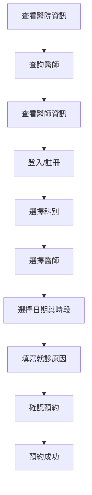

# 第一階段需求分析
分析網站要解決什麼問題、提供什麼功能，主要使用者是誰
## 完成日期:
2026/8/15
## 專案目標:
建立一個醫院預約網站，讓病人可以在線上查詢醫師資訊、查看門診資訊並完成預約掛號。
## 使用者角色:
### 1.病人
- 登入、註冊
- 查看醫院資訊
- 查詢醫師
- 查看醫師詳細資料
- 預約掛號
- 查看預約結果

### 2.醫師
- 醫師登入
- 查看今日預約
- 查看病人基本資料
- 記錄看診結果
- 記錄用藥資訊

## 第一階段開發範圍：

### 1.病人端：
- 首頁
- 醫院介紹
- 醫師查詢
- 醫師詳細資料
- 登入
- 預約掛號
- 預約成功
- 我的預約

### 2.醫師端：
- 先進行 UI 與流程規劃
- 暫不進行完整功能開發

## 主要使用者流程:

## 分析結果：
將完整智慧醫院管理平台拆分成多個階段，第一階段先完成醫院預約網站，避免一次開發過多功能。

## 後續規劃：

- Phase 1：
HTML / CSS / JavaScript / Figma

- Phase 2：
TypeScript / Angular

- Phase 3：
C# / ASP.NET Core / Oracle
